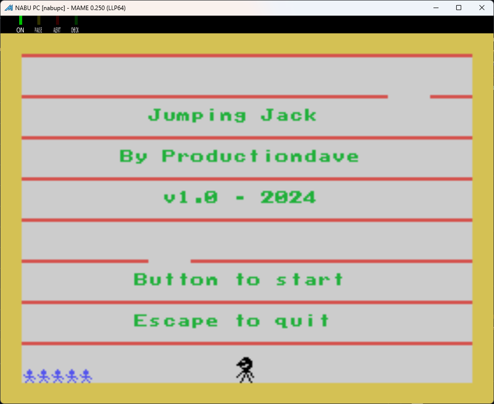

# Jumping Jack Game for Z80 and TMS9918A Video Processors

## Joystick controls:

LEFT - RIGHT - BUTTON to JUMP.

Jump through the gaps until you reach the top.

Fall all the way to the bottom and you loose a life.
